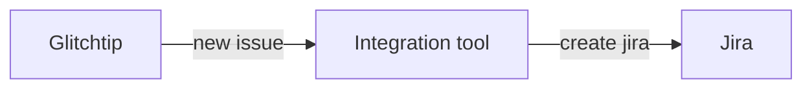
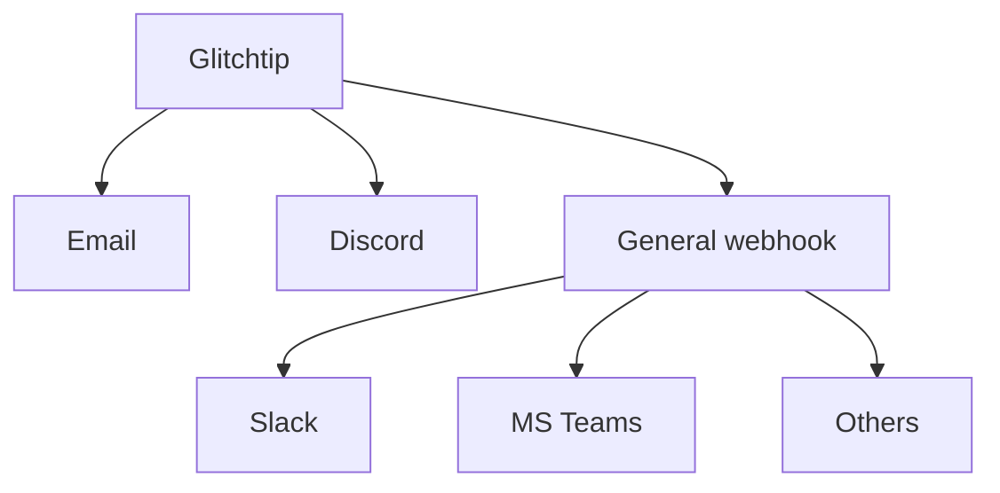
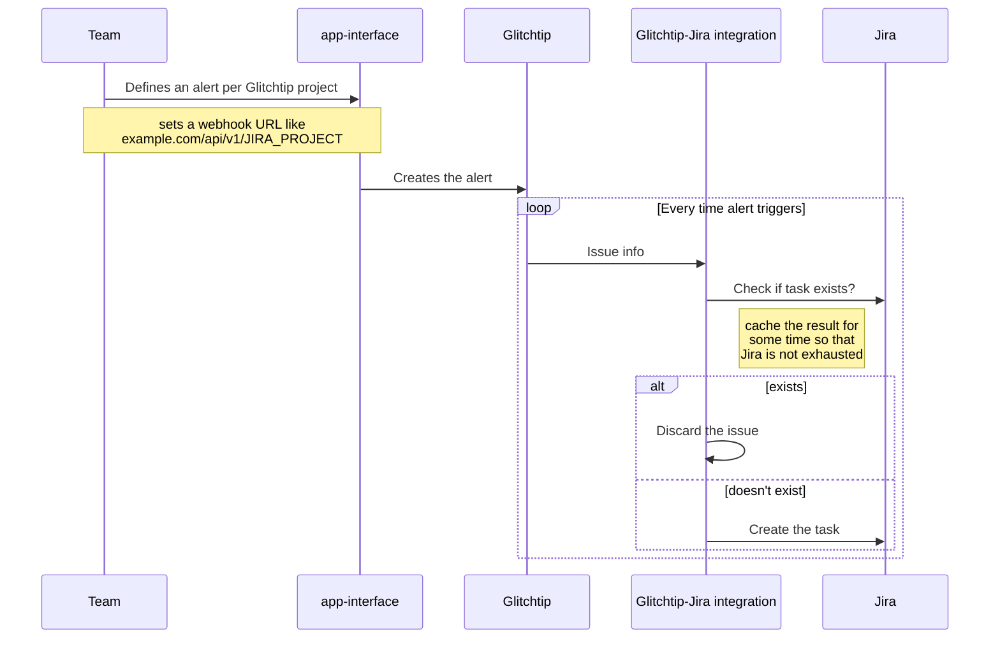

# Design

## High level design

The goal is to have some external service or tool that manages Jira tasks based on Glitchtip events an issues. The MVP would be creating tasks based on new issues:



## What Glitchtip currently supports

The code for the webhook logic can be found [here](https://gitlab.com/glitchtip/glitchtip-backend/-/blob/master/alerts/webhooks.py?ref_type=heads). It supports the following destinations:



We have 2 options then:
1. Add a new integration upstream, meaning
    - new DB field to store the Jira project
    - modifying the backend
    - modifying the frontend
2. Create a separate service and make use of the general webhook mechanism.

Based on the complexity that contributing upstream may have and the freedom that having a separate service brings, we chose the second option.

## Design of the service

### Webhook format

The general webhook has this format:

```js
{
    "alias": "Glitchtip",
    "text": "GlitchTip Alert (${ISSUE_COUNT} issues)",
    "attachments": [
        {
            "title": "${ISSUE_TITLE}",
            "title_link": "${ISSUE_URL}",
            "text": "${ISSUE_CULPRIT}",
            "image_url": "",  // optional, will be empty
            "color": "${ISSUE_HEX_COLOR}",  // optional
            "fields": [
                {
                    "title": "Project",
                    "value": "${PROJECT_NAME}",
                    "short": true
                },
                {
                    "title": "Environment",
                    "value": "${ENVIRONMENT}",
                    "short": true
                }, // if the issue has the environment set
                {
                    "title": "Release",
                    "value": "${RELEASE}",
                    "short": false
                }  // if the issue has the release set
            ],  // optional
            "mrkdown_in": ["text"]  // optional
        }
    ],
    "sections": []  // Just used for MS Teams, so ignoring
```

So the idea is to implement a service that receives this general webhook and creates/manages Jira issues based on these fields.

### Webhook destination

The webhook is sent to a URL using a POST request:

```py
def send_webhook(url, message, attachments = None, sections = None):
    ...
    data = WebhookPayload(
        alias="GlitchTip", text=message, attachments=attachments, sections=sections
    )
    return requests.post(url, json=asdict(data), timeout=10)
```

The url is configured per alert, be it on the UI or in app-interface:
```yaml
---
$schema: /dependencies/glitchtip-project-1.yml
...
teams:
- $ref: /dependencies/glitchtip/teams/my-team.yml
...
alerts:
- name: alert-name
  description: The Alert description
  quantity: 1         # if it detects 1 event
  timespanMinutes: 1  # in 1 minute, it will trigger
  recipients:
  - provider: email-project-members  # send an email to the project members (configured in my-team.yml)
  - provider: webhook  # send a Slack notification
    url: https://hooks.slack.com/services/SECRET_1/SECRET_2/SECRET_3
```

So we have 2 options:
1. Provide the same endpoint for all the tenants and have a map Glitchtip project or Glitchtip team -> Jira project.
2. Provide one endpoint per Jira project, making it easier for each tenant to configure their webhook URLs.

I think the second one is better. For example:

```yaml
alerts:
- name: alert-name
  ...
  - provider: webhook  # send a Slack notification
    url: https://glitchtip-jira-integration.example.com/api/v1/MY_JIRA_PROJECT
```

It's not even necessary to add one endpoint everytime a team creates a Jira project (which is not common tho), we can have a wildcard at `/api/v1/{jira_project}` and use the Jira project as a variable for interacting with the JIRA API.

## Summary



## Other questions

> Why don't you use a Prometheus exporter and publish a metric with the number of events per issue? This way you would be able to create an alert on Alertmanager and connect it to jiraalert. For example: `glitchtip_events{project=my_project, issue=my_issue, } 40`

Because this metric has no boundaries. It can have as many labels as issues in the GlitchTip instance. We can end up with thousands of different time series, which doesn't scale well.

> What if there's a bug generating thousands of new issues (not events) per minute?

We should set some limits per project or some caching mechanism in the tool so that we can prevent floading Jira with new tickets.
